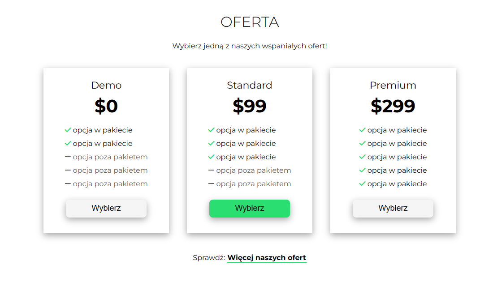

<h1 style="text-align: center;">Forest website</h1>

## Documentation / Dokumentacja

<ul class="nav nav-tabs" id="myTab" role="tablist">
  <li class="nav-item">
    <a class="nav-link active" id="english-tab" data-toggle="tab" href="#english" role="tab" aria-controls="english" aria-selected="true">English Version</a>
  </li>
  <li class="nav-item">
    <a class="nav-link" id="polish-tab" data-toggle="tab" href="#polish" role="tab" aria-controls="polish" aria-selected="false">Polish Version</a>
  </li>
</ul>

  

## Installation 💾
    git clone https://github.com/Softon07/forest-website

Navigate to the project directory:

    cd Todo-List--app
    npm install

To run the project, enter the command:
    
    gulp

## Project Description 🎉

<strong>Access the website directly through the link:</strong>
[Forest](https://softon07.github.io/forest-website/)

The 'Forest' website project was created by me individually as part of the final phase of the course taught by Mateusz Maj from the educational platform https://mmcschool.pl/. The main goal of this project was to practically apply the knowledge and skills acquired to create a complete website according to the provided mockup.

The project focused on replicating the visual layout and elements included in the mockup, with the focus on the desktop version of the homepage.

It should be noted that while the mockup included the main page and its desktop version, it did not include the two key subpages, "Offer" and "Contact". For the 'Contact' sub-page, I was given instructions to add a map and a contact form, but the details of 'Offer' and 'Contact' were left to my own creativity and interpretation, in keeping with the spirit of the project.

In short, the 'Forest' project was my independent work, based on the mockup, but the "Offer" and "Contact" sub-pages required me to be more creative, and the detailed guidelines for these sub-pages were limited.
 

## Technologies used 🔧

- HTML
- SASS
- JavaScript
- Gulp

## Screenshots 📺

## Author 🧑

- Marcel Nędza

## Thanks 👏

to https://mmcschool.pl/

  

## Instalacja 💾
    git clone https://github.com/Softon07/forest-website

Przejdź do katalogu projektu:

    cd Todo-List--app
    npm install

Aby uruchomić projekt, wprowadź polecenie:
    
    gulp

## Opis projektu 🎉

<strong>Wejdź na stronę bezpośrednio przez link:</strong>
[Forest](https://softon07.github.io/forest-website/)

Projekt strony 'Forest' został przeze mnie stworzony indywidualnie jako część końcowej fazy kursu, której autorem jest Mateusz Maj z platformy edukacyjnej https://mmcschool.pl/. Głównym celem tego projektu było praktyczne zastosowanie zdobytej wiedzy i umiejętności w celu stworzenia kompletniej strony internetowej zgodnie z dostarczonym mockupem.

Projekt skupiał się na odwzorowaniu wizualnego układu i elementów zawartych w mockupie, przy czym skupiono się na wersji desktopowej strony głównej.

Należy zaznaczyć, że choć mockup obejmował główną stronę i jej wersję na desktopie, nie obejmował on dwóch kluczowych podstron: "Oferta" oraz "Kontakt". W przypadku podstrony "Kontakt", dostałem wskazówki, żeby dodać mapę oraz formularz kontaktowy, jednak szczegóły dotyczące "Oferty" oraz "Kontaktu" były pozostawione do mojej własnej kreatywności i interpretacji, zgodnie z duchem projektu.

W skrócie, projekt 'Forest' był moją samodzielną pracą, bazującą na mockupie, jednak podstrony "Oferta" i "Kontakt" wymagały ode mnie większej inwencji twórczej, a szczegółowe wytyczne dotyczące tych podstron były ograniczone.
 

## Wykorzystane technologie 🔧

- HTML
- SASS
- JavaScript
- Gulp

## Screenshots 📺

## Autor 🧑

- Marcel Nędza

## Podziękowania 👏

Dla https://mmcschool.pl/
